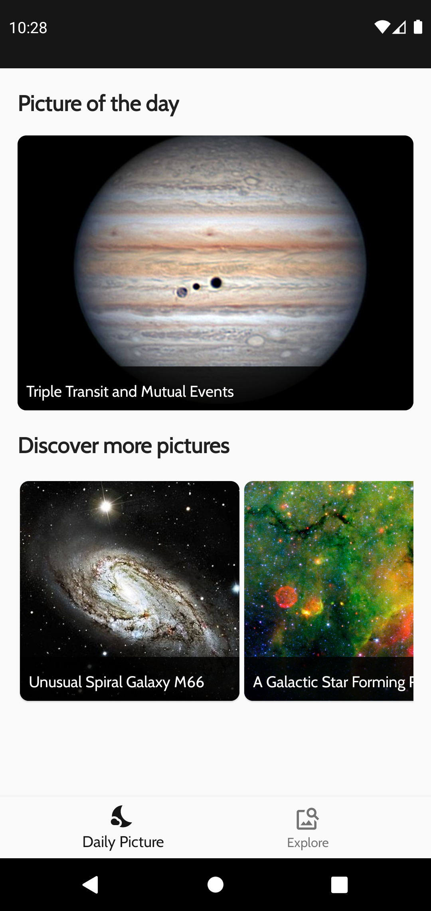
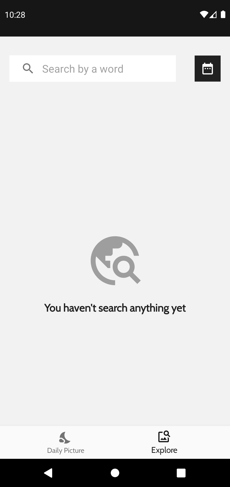
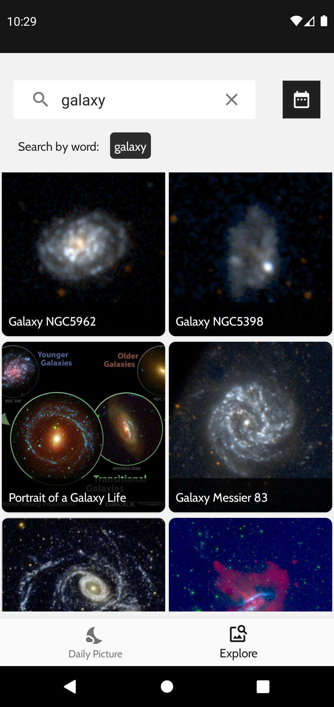
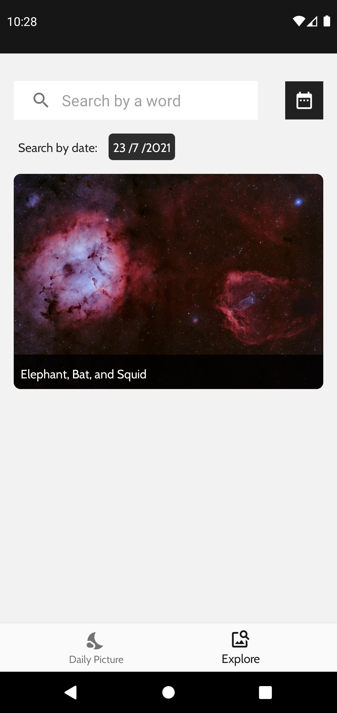
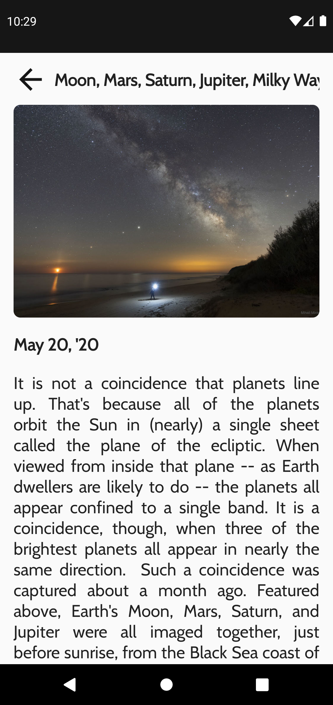
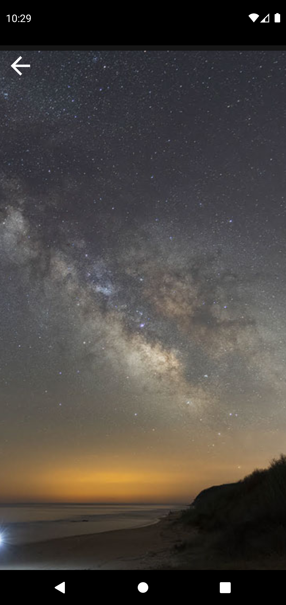

# APOD & Image galery

This app call some NASA APIs to get the Astronomic Picture of the Day or search by a keyword for a picture from the NASA

I created this app time ago, and I decided to finish it. I wanted to play with LiveData, View Models, Coroutines, binding adapters and also get fun with some minimalistic UI...

The apis that I use are:

* APOD for HomeScreen
* NASA Image and Video Library, for SearchScreen and also Homescreen

Link for reference:

https://api.nasa.gov/

## Screenshots

